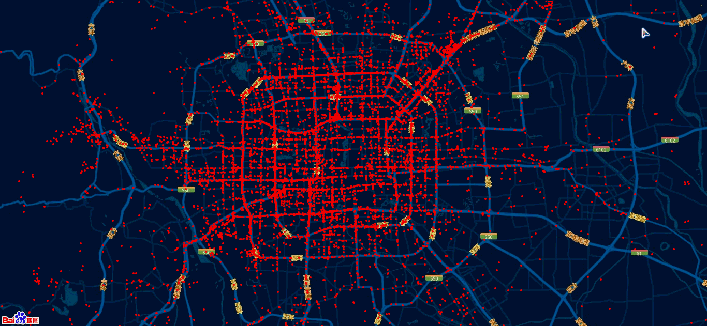

# TrajectoryVisualization
===========
**TrajectoryVisualization 轨迹数据可视化**  
北京市出租车某天一小时内的轨迹情况  
基于[MapV](https://github.com/huiyan-fe/mapv)实现  

*演示地址：http://qingyunwhu.github.io/TrajectoryVisualization*  

